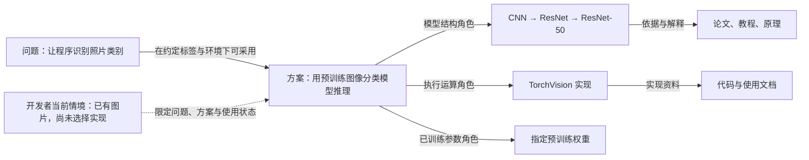
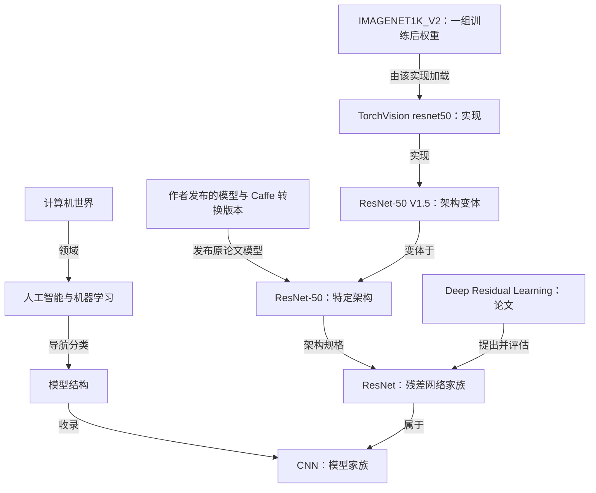
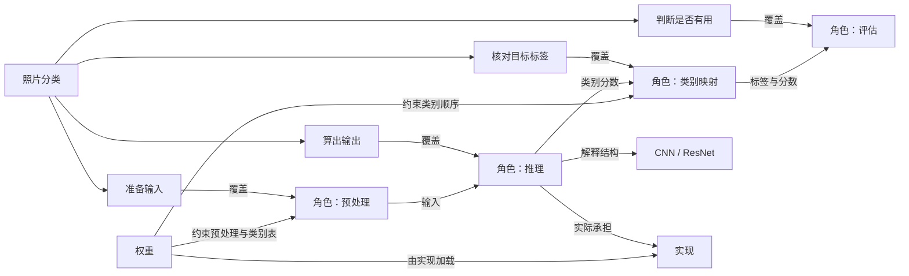

# 三树对齐：开发者的问题、解决方案与知识

> [INPUT]: 2026-09-06 三树模型记录中的技术正文和公共虚构情境约定。
> [OUTPUT]: 保留原章节编号的公开模型依据，供照片分类主张 C14/C15 回查。
> [POS]: planning 的历史语义记录；当前可用入口见 [README](../README.md)，正式数据与编译格式以 data 和 scripts 为准。
> [PROTOCOL]: 变更时更新此头部，然后检查 CLAUDE.md

本文件是 2026-09-13 整理的公开阅读版本，不是内部模型审查原稿的逐字副本。保留原§1—14及§15旧引用兼容的技术正文；§11—13与§12 A的编号和内容未改，省略内部写入分工与交接清单。

正文中的“当前”“本轮”“尚未实现”、T27/T28等阶段标记均指历史模型讨论，不能当作现行产品状态或已经支持的全部输入格式。现行页面已提供首页、原地图和照片分类三树样例，具体职责见模块地图；存储和HTTP/2仍是模型说明。真实用户试读尚待取得，个人状态保存未实现。资料核对按原记录日期理解，本次整理不代表重新访问原站。

## 1. 已确认的问题

P13 本轮重新读取当前源码与内容正本，未把旧 g/m 当成页面正文。工作区 HEAD 为 `ce5daf186dd6290e711eb78d46ab72cfdcab6b46`，规划文件含未提交工作，不能仅用 HEAD 标识候选；输入摘要见 T27-HANDOFF。下表数量、节点和正文来源仍准确；需细化的是编译边界：未知分类字段可能被浅复制，而 entries 的新字段不会自动进入 CONTENT；两者都没有新语义校验或详情支持。

| 观察位置 | 当前事实 | 读者受到的影响 |
|---|---|---|
| `data/concepts.json` | 共 1,739 节点；`t` 为 root 1、group 24、concept 280、item 1,420、contrast 14，并与现有深度绑定。 | 表示树中位置的类型，未充分说明对象究竟是什么。 |
| CNN #1453 | 路径是计算机世界 → 人工智能与机器学习 → 模型结构 → 卷积网络 CNN；是 item，无子节点、无显式关系。 | 一个模型家族被展示为到此结束的具体条目，读者找不到具体架构、实现和训练产物。 |
| SQLite #946 / HTTP/2 #889 | 也标成 item。 | 软件项目、协议与模型家族共用含混的身份标签。 |
| `src/details.js` | item 显示“具体条目”；来源按网址合并，展示支撑范围和 checkedAt。 | 有基础资料与页面核对提示，但没有对象现状、内容逐项审核或论文代码关联视图。 |
| `data/entries/20-machine-learning.json` | CNN 有基础解释，sourceIds 仅为 nn / cs231；指向 PyTorch 神经网络层总页、CS231n 课程页，均无 checkedAt。其他条目已有论文链接。 | 缺少直接解释 CNN 的具体资料、代表架构和对应研究/实现链；并非整个项目从来没有论文。 |
| `scripts/content.mjs` | 合成正文、来源、同一对象和各处语境；不会编译新的对象语义或审核记录，旧 draft 字段从浏览器快照移除。 | 旧释义草稿状态不能代替当前 entries 内容的审核状态。 |

主要缺口是“我在解决什么 → 可以怎样做 → 这里用到的东西是什么 → 怎样使用与验证”的联系。只增加徽标或把 item 改名为 entity 不能解决它。

## 2. 用户明确的方向：以开发者的使用处境贯穿三树

三棵树分别组织不同问题，底层通过有含义的多对多关系连接：

| 层 | 回答的问题 | 应承载的内容 |
|---|---|---|
| **问题树** | 我想做什么，现在卡在哪里？ | 目标、当前现象、期望结果、限制；父问题拆成需要解决的子问题。 |
| **方案树** | 在这些条件下可以怎样做？ | 可选方案、每个部件的职责、协作过程、必须/可选条件、变体和验证结果的方法。 |
| **知识树** | 方案里这些东西是什么，为什么起作用？ | 领域、分类、方法/类型、具体对象、机制与边界、论文和实现资料。 |



图是示例关系，未经用户验证的技术方案不能标为唯一或最佳。沿知识节点应能反查“它能帮助哪些问题、在什么方案中承担什么角色”；反查会得到多个结果，不是数学意义上的唯一逆映射。

### 开发者使用状态应该放在哪里

先表达目标、环境、限制、已有条件、当前卡点，再按需要记录“某个方案角色在当前情境中的使用情况”。状态归属于 `使用情境 × 方案及其角色`；关联的知识对象帮助说明这一状态，不能全局写成“SQLite 已采用”或“CNN 未学会”。

例如，同一位开发者在项目 A 已采用 SQLite，在项目 B 还在评估它；同一方案已选 ResNet，但还未取得匹配权重。页面可以显示“本方案需要：预处理、实现、权重；你已具备：图片；下一步：核对标签是否符合任务”，而不是给 CNN 一个不知所指的“进行中”。

使用记录分开表达选择、接入、当前阻碍与检查引用，最小含义以 §11 为准。角色是否需要由条件决定，检查通过在独立检查记录表达，不混入选择或接入枚举。它们不是一条所有对象都必须走完的状态机。已采用不等于已理解，运行一次成功不等于整个问题解决。

首轮用明确的虚构使用情境检验模型；个人状态是否保存、怎样保存仍待决定，本机独立记录也只是候选。公共知识数据与私人项目情况分开。无需先引入账号、云同步或自动监控，也不根据访问页面自动判定“用过/学会/已完成”。§11 给出最小状态含义与版本作用域，不代表已批准记录功能。

### “态射”至少保留哪些对应

这里把态射落实为可检验的语义对应，不宣称三棵目录树已经满足某套严格数学公理。

- 问题拆成子问题时，方案应说明哪个步骤或角色覆盖哪一项；不完整覆盖需明确空缺。
- 区分“这些子问题都要解决”与“这些方案择其一”，把必需、可选与替代条件保留下来，不能全画成没有说明的父子边。
- 方案中的协作关系应能回到知识层解释。例如“实现加载权重”要落到实现与权重的关系，而不仅是两个名字都在成员列表里。
- 条件和变体跨层保留：某套权重的标签不满足目标时，原推理方案并未解决该问题；不能沿着“都是 CNN”推导方案可行。
- 问题到方案、方案到知识均允许多对多和暂缺映射；方案可包含多个知识对象，一个对象可服务多个方案。不同树的父子边表达不同含义，不能直接逐层复制。
- 一个部件替换成另一个，须保留它在方案中的职责并重新核对接口、环境及结果标准。“同类”“固定搭配”都不能自动推出可替换。

### 从固定搭配到可采用的方案

当前 `data/bundles.json` 的 21 组组合只有 name/note/members。例如“JavaScript 生态”同时包含多种框架，它是探索线索，不能当成需要全部安装的配方。保留人工组合的身份与名称，从中挑选适合一个问题的子集并补充：

`解决的问题 + 适用条件 + 部件角色 + 协作步骤 + 可选变体及条件 + 结果检验`

这些信息构成方案候选；原组合仅作来源或关联，不自动提升为已验证方案。

### 两个贯穿例子

| 使用问题与条件 | 方案候选及子问题 | 对齐到知识层 | 怎样判断解决了 |
|---|---|---|---|
| 给照片分到预训练模型已有标签中；先验证单张图片推理 | 取得图片 → 按权重要求预处理 → 匹配实现和权重 → 推理 → 检查输出标签 | 图像张量、预处理、CNN/ResNet、框架实现、权重、类别映射；各角色有对应资料 | 实际跑通一张图仅证明调用；还须用目标样本和事先约定标准判断结果是否有用。未实测保持待验证。 |
| 给自定义商品分类，标签不在预训练集合中 | 先明确标签和数据，再比较适配已有模型/训练等候选；前一方案不能直接算成功 | 数据集、分类头、迁移学习、损失函数与评估；CNN 是候选知识之一 | 需要独立评估数据与结果标准；本轮不承诺执行训练或指定唯一技术路线。 |
| 网页刷新后记录消失；先查清是否只有浏览器端、是否需要跨设备共享 | 分解为保存位置、写入、再次读取、共享/权限等子问题；仅本机与服务端共享是不同方案分支 | 浏览器存储、服务端处理、SQLite/PostgreSQL 等按条件进入；不默认每个网页都需要数据库服务 | 刷新/重启或跨设备场景按范围实测；不能因为选择了数据库名字就标问题解决。具体方案需另查来源。 |

技术条件用于建模反例，尚不是已测试的教程或选型建议。CNN 样例优先用于把三层串起来；存储方向继续作为已有 Q-M1 候选与跨域反例。

## 3. 为什么不直接把所有分支加到同一深度

具体决定是：目录父子关系是否可以直接当作类别与实例关系，三层对应需要保留哪些语义。现有代码能证明身份现在混在一起，却不能证明怎样划分更好；因此参考知识组织和类/实例建模的既有区分，再用本项目例子检验。

起点可以想成书架：书架上的“机器学习”说明资料放在哪里，一本论文说明谁提出了什么，附带的代码和训练结果是另外的东西。书架格子的上下层并不自动说明它们是同一种东西。这里只作理解场景，不声称重建了分类学的唯一历史。

| 既有实践与资料 | 保留的区分 | 对本项目的限制与取舍 |
|---|---|---|
| W3C SKOS Primer，2009 工作组说明，2023 链接修订；见 §2.3、§4.1、§4.7、§5.2。 | 导航集合、宽窄主题、部分整体和类实例关系需要区分；普通层级边没有包含所有这些含义。 | 借鉴区分；不据此要求产品引入 RDF、推理器或复制完整词表。 |
| W3C OWL 2 Primer 第二版，2012 Recommendation；见类、子类与个体说明。 | 类别间的包含与具体对象属于类别是不同命题。 | 类/实例不能由深度猜出；本项目用直白关系呈现，具体架构的建模粒度由样例检验。 |
| ResNet 原论文、作者发布物、TorchVision 文档。 | 方法、实现、权重和实验记录具有不同身份，发布方报告与本项目实测分别记录。 | 同样叫 ResNet 不等于实现细节相同；论文、代码、权重需要多对多关系。 |

来源：[SKOS Primer](https://www.w3.org/TR/skos-primer/)、[OWL 2 Primer](https://www.w3.org/TR/owl2-primer/)。以上是设计参照，不能据标准名称把本提案写成已验证正确；当前用户反馈和试读仍决定取舍。

从目录浏览到 Agent 查询，增加的要求是机器也要分辨每条边的含义和证据。保留逐层探索的方式；试验更明确的对象身份；舍弃“深度决定对象类型”和“有链接等于已复现”的推断。暂不引入知识库服务器。

## 4. 知识层：导航位置与对象身份分别记录

用户提出的 `原点 → domain → category → type → entities` 适合作为从全景走向具体对象的阅读方向。建议允许类别继续细分，也允许直接打开已足够具体的对象，不为齐整而填空层。

| 问题 | 候选表示 | 例子 |
|---|---|---|
| 我从哪里找到它？ | 导航角色与落点 | 原点、领域、分类、条目；同一对象允许多个落点。 |
| 它是什么东西？ | 对象种类 kind | CNN 是模型家族，ResNet-50 是特定架构，SQLite 是软件项目，HTTP/2 是协议。 |
| 它与哪个东西有什么关系？ | 有方向、有含义的边 | 属于某类、是其变体、由论文提出、代码实现、权重适配。 |
| 在我当前工作中怎么用？ | 使用情境与方案角色的状态 | 这个方案是否需要它、是否已选实现、卡在哪一步。 |

kind 是“东西的种类”；Type / Instance 是两个对象之间的关系，不能都塞进原来的 `t`。一个分类落点也可以指向需要解释的概念对象。叶子只是目前尚未展开，不等于现实中没有更具体的对象。

下列词表只覆盖首轮样例：模型家族、模型架构、软件项目、协议、论文、代码实现、模型权重、文档/教程。后续通过各域抽样细化，不能机械地把 1,420 个 item 批量贴为实例。

## 5. CNN 应当怎样让人看懂

建议详情第一屏先给出这样的解释草稿：

> **卷积神经网络 CNN · 模型家族**
>
> 想让程序判断一张图片里有没有猫，可以先让同一组“小窗口检查器”在图片不同位置寻找局部图案，再把这些结果逐层组合，用于分类等任务。CNN 把这种局部处理和参数共享组织成网络；检查器的参数通常由训练学出来。
>
> CNN 是一类网络的共同做法。ResNet 是其中一类架构；ResNet-50 给出了更具体的层与连接安排。实现代码负责把这些运算写出来，训练后的权重则保存学到的数值。拿到架构名称，并不意味着已经拿到能直接识别图片的模型。

这是用于试读的内容候选，不承诺每个神经元都对应一个人能命名的图案，也不将 CNN 说成只处理图像。正式入库前仍需按表述核对来源。



图中的关系含义按 §10、§13 收敛，机器字段拼写交 P04。CNN → ResNet → ResNet-50 是知识对象的逐步细化，不是一套可执行方案；某份确定权重才是具体训练产物。不能把每一层都叫 instance，也不能把代码放在架构下面就默认它“是一种架构”。

## 6. Paper with Code 作为三树下的资料阅读方式

每个研究相关对象可切换到“论文与实现”视图；用同一批对象与资料关系生成，不复制第二套内容。不要求论文和代码挤进唯一一条树枝，也不要求所有概念都有原创论文或可执行代码。

| 对象 / 材料 | 入口 | 本轮核实的关系与边界 |
|---|---|---|
| ResNet 论文 | [Deep Residual Learning for Image Recognition](https://arxiv.org/abs/1512.03385) | He、Zhang、Ren、Sun；2015-12-10 首次提交。论文提出残差学习；全文见 [v1](https://arxiv.org/html/1512.03385v1)。不是所有 CNN 的唯一“原始论文”。 |
| 作者发布物 | [KaimingHe/deep-residual-networks](https://github.com/KaimingHe/deep-residual-networks) | 提供原论文 ResNet-50/101/152 模型的 Caffe 转换版本，用于测试或微调；作者说明模型并非用该 Caffe 版本训练。不能标作完整原始训练代码。 |
| 框架实现与文档 | [TorchVision resnet50](https://docs.pytorch.org/vision/stable/models/generated/torchvision.models.resnet50.html) | 框架官方实现；文档注明步长安排不同于原论文，称 ResNet V1.5。官方属于框架方的身份，不能写成论文作者实现。 |
| 预训练权重 | 同一份 TorchVision 文档中的 `ResNet50_Weights.IMAGENET1K_V2` | 权重与实现分开，配套预处理和训练说明；发布方指标不记成 Atlas 实测结果。正式入库要固定实际版本/权重引用。 |
| CNN 入门材料 | [TensorFlow CNN 教程](https://www.tensorflow.org/tutorials/images/cnn) | 提供动手理解 CNN 的入口；正式内容任务核对适用环境，不用它代替 ResNet 论文。 |

P13 本轮再次核对论文 v1、作者库 README，以及 [TorchVision 0.23 的 resnet50 文档](https://docs.pytorch.org/vision/0.23/models/generated/torchvision.models.resnet50.html)和[对应源码文档](https://docs.pytorch.org/vision/0.23/_modules/torchvision/models/resnet.html)。以 0.23 作为本轮资料坐标，不宣称它是最新版本或已经验证的安装组合。源码记录 V2 权重文件为 `resnet50-11ad3fa6.pth`；未下载、未核完整文件摘要，文件名后缀不能当完整内容哈希。页面核对日期为 2026-09-06；未安装依赖、推理、训练或评测，作者库与框架项目的当前维护状态均未专门检索。

最少记录三类信息：资料自身的类型/标题/出处；资料与哪个对象有什么关系；我们核查或运行到哪一步。论文与对象、实现与论文均为多对多：一篇论文可能提出多个方法，一个方法可能有多篇后续论文，一份实现也可能覆盖多个方法。

建议的关系例子是“论文提出/评估方法”“实现依据论文”“代码实现某架构”“某权重由某实现加载”“文档解释某对象”。每条重要边可附证据、限定和核对记录。资料标题含有 CNN 或 ResNet 不能自动生成这些关系。

## 7. 辅助信息：维护、审核和运行证据

用户已明确主状态是开发者使用状态，见 §2。以下信息用于帮助选择和核查，不能替代使用处境；不因为这次讨论而扩大为全库生命周期标注工程。个人收藏、读过/学会等学习状态继续留在后续体验候选。

| 状态轴 | 回答什么 | 记录方式与边界 |
|---|---|---|
| **对象现状** | 这个东西在什么情境下仍有用，项目/标准现在怎样？ | 按对象采用相应规则，例如软件维护状态、协议标准状态；带来源、日期和版本/情境。不确定写待核实；CNN 不套用代码库“活跃/归档”。适用性用有依据的说明，不给整个家族贴“已过时”。 |
| **内容核对** | 我们写的解释、分类与关系审到哪里？ | 分别保存待审核/已审核/需复核；已审核绑定内容版本、核对者、范围与依据，改动影响结论时重新打开审核。现有正文齐全不能自动迁移为已审核。 |
| **材料可得与运行验证** | 有什么材料，能否取得，我们实际做到哪？ | 每份材料分别记录链接/可得性；运行记录区分未运行、加载/推理验证、训练验证及特定实验复现，分别绑定环境、输入、结果和证据。不同实验的结果不能用一个成功状态覆盖。 |

“缺少论文/代码”还应区分未检索、已查但未找到、作者明确未提供、不适用、链接失效。没有收录不能写成现实中不存在；暂未实测也不能写成不能运行。

来源身份（作者、框架官方、第三方）属于出处信息，发表日期属于时间信息；这些都不是内容是否可信的自动结论。首屏显示有助于判断的中文身份和关键状态，其余细节展开；避免把十几个字段直接排成标签墙。

## 8. 最小实现边界（候选）

先把一个“照片分类”的问题、方案和 CNN—ResNet 知识链做成可往返的完整样例，以存储问题检验跨域对齐，以 HTTP/2 检验对象类型。采用可叠加的情境、方案、元数据与带依据的关系，保留原下标、树位置和人工组合；具体文件归属由 T27 确定，不先创造第二套正文。

- 导航落点与对象身份有独立含义；同一对象多个落点共享身份，局部语境继续保留。已有显式同一对象组若出现分类冲突，保留冲突并核对，不强取最小编号的 kind 覆盖全部落点。
- 首轮新对象可先出现在详情的关联资料区，是否升为树节点须说明阅读价值。无需为了资料记录一次性重建全树；旧地址、搜索、组合和同物多落点必须仍可用。
- 新字段必须经历“正本 → 校验/编译 → 网页”闭环，再进入快照/CLI。仅在 JSON 里写字段而构建丢弃它们不算完成。
- 保持来源已有身份和支撑范围。论文的版本、出版页与预印本不能仅凭 URL 不同就算不同研究；同 URL 的记录也不能把不同关系的核对状态合并成一个“已审核”。
- 网页、快照与 CLI 对相同版本使用同一套身份、关系与未知状态。不把草案名称宣传为已经可查询的字段；T06 定稿依赖 T28 的实际样例。
- 公共快照提供问题类型、方案及知识映射；实际使用情境和个人使用状态由调用方或本地记录传入。Agent 查询应能回答“针对当前问题有哪些方案、条件是什么、各部件为何需要”，而不仅检索术语；不能把私人状态混入公共静态数据。
- 不引入统一“可靠度分数”，不根据更新时间推断过时，不用 Agent 自动分型的置信度替代维护者审核。

## 9. 如何检验方案，哪些还没完成

T27 明确问题、方案、知识与使用情境的边界及映射；T28 实现首个样例数据、映射和编译并补齐 CNN 资料；T29 在当前网站走通问题 → 方案 → 知识与反查，按使用情境呈现必要信息；T30 真实试读并修订；T31 发布对应候选并核对公网。任务状态与 Prompt 分工只在 PLAN 登记。

读者试读至少回答：

1. 从自己的使用问题出发，能否找到一个适用条件明确的方案，知道现有条件与缺少哪一步？
2. 为什么这个方案涉及 CNN；它是一段程序、一份训练完成的模型，还是一类网络？ResNet、实现代码和权重各承担什么角色？
3. 换成模型标签之外的商品分类时，为什么不能把刚才的方案直接视为已解决？从知识节点能否回到相关问题与方案？
4. 去哪里读论文、看代码、取得权重？作者发布物与框架实现有什么已知差别？看到“作者发布”“页面已核对”“未实测”时，各能得出什么结论？

同时检查 SQLite 仍能被解释为软件项目、HTTP/2 仍能被解释为协议；它们不必长出 CNN 一样多的层级或同一套状态。如果需要额外口头解释才能辨别这些身份，修改详情与结构后复测。

本文提供 T27 的模型决定候选；没有完成三树数据与交互、使用状态记录、全库分型、真实试读、接口实现或上线。下文固定首轮结构与语义，机器字段拼写、具体页面和个人保存方式仍各归后续职责；P06 的模型审核不能替代 T28/T29/T30 的实际验收。

## 10. T27 边界取舍与首轮范围

这里的“取舍”是本轮 P13 提交 P06/P12 的明确模型选择，不冒充用户逐字段批准。允许读者沿树浏览；跨树信息由带语义的关系保存，不由三棵树的屏幕位置推导。

| 对象 | 边界决定 | 不从它推出什么 |
|---|---|---|
| 问题 / 子问题 | 公共问题描述可重复遇到的障碍与期望；父问题用“全部需要 / 择一满足 / 条件成立时需要”明确分解，子问题仍须能判断有没有解决。 | “CNN 是什么”可作阅读问题，但不能直接替代开发问题“怎样把照片分到目标类别”。 |
| 使用情境 | 某次工作的目标、环境、约束、已有材料、卡点；引用公共问题并补充本次判据。公共样例明确标为虚构，实际项目记录归个人。 | 缺省条件不是满足；公开例子不代表访问者真实处境。 |
| 方案 | 带适用条件的做法；包含角色、协作连接、问题覆盖、结果判据和未覆盖项。身份区别于组合、知识对象与一次执行。 | 有成员列表不等于方案完整；覆盖问题不等于已解决。 |
| 方案角色 | 方案内需承担的职责，可由一个或多个对象协同承担；区分解释该职责的知识与实际承担它的实现/产物。角色 ID 只在方案版本内有意义。 | CNN 解释推理结构，不作为一个可下载的运行部件。 |
| 方案变体 | 保留共同目的并明确改变哪些角色绑定、连接、条件或判据；首轮展开为可独立检查的完整记录，保留来源变体引用。 | 不依赖隐式继承；换权重不是只改名称，标签和预处理也要重新核对。 |
| 知识对象 | kind 表示对象种类；导航落点、类属、规格、变体、组成和实现分别表达。 | 不由 t、深度、同名决定 kind 或同一身份。 |
| 资料对象 | 一篇论文、一份实现或权重可以既被介绍、又作为资料使用，复用一个对象身份，出处记录只负责载体与定位。 | 不另建一份同名“资料版对象”或第二套解释。 |

首轮完整正向样例限定为“照片按指定权重已有标签做本机推理”；“自定义商品标签”作为不能直接采用的反例。范围不包含训练教程、最优模型选型、自动批量分类产品或安装执行。存储和 HTTP/2 只做跨域模型样例，不自动成为 M1/T01 或 M2/T15 的选题。

| 放到哪里 | 首轮对象与原因 |
|---|---|
| 问题树样例 | 照片分类及标签、输入、推理、结果判断四个子问题；存储与网络问题在评审例子中展示，不扩成全量问题库。 |
| 方案树样例 | 预训练推理及其职责；自定义标签适配只列“待比较方案”的分支与缺口。角色是方案局部节点，方案变体边不同于部件边。 |
| 既有知识树 | 保留所有 raw 落点。首轮沿用 CNN #1453、PyTorch #23/#1446；SQLite #946、IndexedDB #1188、HTTP/2 #889 等作反例引用。**首轮不新增知识树 raw 节点。** |
| 知识详情关联 | ResNet 家族、ResNet-50、V1.5 变体、TorchVision 特定版本实现、V2 权重、预处理、标签映射、论文和作者发布物；各有可辨身份，能返回其角色与问题。 |
| 情境区 | 虚构场景的已知条件、未知条件、当前缺口、下一步及虚构状态；实际个人记录不混入以上公共树。 |

这样可以试读 CNN 的“家族—架构—实现—权重”，同时不让 HTTP/2 为了对齐多长出一层权重。是否将 ResNet 等升为树节点留给真实阅读反馈；这一保留不妨碍 T28 先做详情关联。阅读深度不固定，当前首页不替换。

## 11. 最小使用状态：只描述这次工作的选择与接入

使用状态的最小主体是：`本地使用者 + 情境修订 + 方案修订 + 变体 + 角色 + 绑定项`。绑定项区分同一角色的多个部件或候选；角色尚未选对象时允许为空，但不能由空值推断“不需要”。同一人、同一方案两次尝试也要有不同情境修订或尝试引用。

| 轴 | 最小含义（编码候选） | 约束 |
|---|---|---|
| 选择 | 尚未决定 / 已选 / 本次不选（`undecided / chosen / not_chosen`） | “本次不选”不等于客观不适用。方案要求的角色不能被用户勾掉就算覆盖完整。 |
| 接入 | 尚未开始 / 正在接入 / 等待检查（`not_started / in_progress / awaiting_check`） | 不强制单向流程；若选择后失败，仍可保持已选，附阻碍与失败检查。 |
| 阻碍 | 一句具体缺口，可为空；附由谁、何时报告 | 未记录不等于不存在阻碍；不依赖页面访问推断。 |
| 检查引用 | 关联本次检查记录，可无 | 通过与否在检查记录中；不另设一个可随意全局传播的“已完成”。 |

没有记录时显示“尚未记录”，不能初始化为“未开始”并暗示知道用户情况。“本情境不需要某角色”由方案条件判断：条件为假才能解释为不要求；条件未知时提示待确认。角色需要与否、用户选没选、方案适用与否、检查结果四者独立。

检查记录必须保留：检查范围（部件 / 方案调用 / 问题结果）、情境和方案版本、实际绑定、输入与环境、判据、结果（未检查 / 通过 / 未通过）、证据。某角色通过不自动升级整个方案；调用成功不自动升级问题结果；这些均不记录“学会”。判据未知时不能给问题结果通过。

条件、实现、权重、角色或结果标准变化，生成新修订；旧记录可看历史，但不得默认套用新处境。此处决定的是语义失效规则，不要求首轮实现事件日志、自动追踪或状态保存服务。

| 虚构情境 | 本次记录 | 应呈现的当前处境与下一步 |
|---|---|---|
| 照片 A：图片已备好，目标标签未核对 | 结构选 ResNet-50 V1.5；实现未定；权重未取得；尚无检查 | 先核对目标标签是否在指定权重类别表里；点类别映射解释为何“能输出标签”还不够。 |
| 照片 B：实现/权重已接入，一张图返回输出 | 接入等待检查；调用检查通过；问题结果未检查 | 继续用预先选定的目标样本和判据评估；CNN 没有因此变成“已学会”。 |
| 项目 A：SQLite 是主存储；项目 B：SQLite 只是候选 | 两个情境两条选择记录 | A 的选择不带到 B；在 B 先核写入安排和共享要求。 |
| 同项目：SQLite 同时作缓存与主存储候选 | 相同对象、两个角色/绑定，缓存已选、主存储未定 | 分别说明两个职责，不能仅按对象 ID 合并成“SQLite 已采用”。 |

首轮只承诺可复述、可检查的虚构情境数据；个人持久保存方式继续待定。使用者标识是调用方本地作用域，不提出账号体系。公开构建以允许字段和文件来源为边界，不靠删除一个 `userId` 来“匿名化”私人数据。

## 12. 三条可往返路径与条件变化反例

### A. 照片分类：四个问题怎样落到方案

公共问题 `photo-classify`：给照片输出有用的目标类别。其四个子问题全部需要；其中前三项做完仍可能在第四项失败。

| 子问题 / 期望结果 | 方案职责与连接 | 知识解释 / 实际部件 | 判断范围 |
|---|---|---|---|
| `labels`：目标类别能否表达？ | 标签核对；输出解释使用同一权重的类别顺序 | 类别映射解释；指定权重的类别表承担映射 | 目标标签有明确对应；未核对则条件未知。 |
| `input`：图片能否成为模型需要的输入？ | 图像解码 → 配套预处理 → 推理输入 | 图像张量、预处理解释；所选权重配套变换承担处理 | RGB、形状、缩放/裁切和归一化按所选规格核对。 |
| `inference`：怎样算出输出？ | 实现加载匹配权重；输入进入实现，输出送类别映射 | CNN/ResNet 解释结构；TorchVision 实现 + 权重实际执行 | 在记录的环境中加载及一次推理；不称论文复现。 |
| `useful-result`：输出是否能用于这批照片？ | 用预先约定的目标样本评估，检查不合用输出 | 评估方法解释；人工标注/判据是情境输入 | 示例约定 20 张目标照片、top-1 至少 18 张匹配，且逐张查看错误；仅为教学小样本判据，不证明生产泛化。 |

上述数字是虚构情境的自定验收，不是文献推荐阈值或真实测量。方案未覆盖自动分类所有照片、拒识未知类别、隐私部署或业务接入；不能将未覆盖项藏在“完成”里。



往返要求：从 `photo-classify/inference` 到推理角色，再开 CNN #1453；反查 CNN 时返回该问题、方案变体、角色、“解释结构”用途、标签/环境条件和未检查结果，继续点开实现与权重。不能只返回“CNN 用于图像分类”。从权重返回时仍是同一个绑定项；不凭名重新挑选 `DEFAULT`。

条件变化：用户改为按自家商品 SKU 分类，类别表不能表达目标。旧方案对新目标的适用条件为假，虽然仍能运行也不能判问题解决；下一步是明确标签/数据与评估，再比较适配或训练等方案。换成 V1 权重时要重查配套预处理与检查记录；未核对兼容的任意 Caffe 权重不能填进 TorchVision 绑定。

### B. 存储：同一对象能承担不同职责

问题 `keep-records` 拆成写入、再次读取、按需求共享。虚构情境 S-A 只要求同一浏览器存储范围内刷新后读回，且不含清除站点数据；候选方案“用 IndexedDB 写入并读取记录”覆盖前两项，共享条件为假。IndexedDB #1188 是浏览器数据库 API 的知识入口，其数据库按 storage key 划分；这不构成跨设备共享保证。[IndexedDB 3.0 §2.1](https://www.w3.org/TR/IndexedDB-3/#database-concept)

情境 S-B 要两台设备共用记录：单机方案的覆盖不足，需增加服务端处理、持久存储与访问控制等职责。SQLite #946 可作应用服务端的存储部件，也可在别的方案作本地缓存；“多用户”不能单独推出“禁止 SQLite”。应核对是否经应用服务访问、写入并发及部署限制，不能把数据库文件直接当成共享 API。[SQLite 官方适用场景](https://www.sqlite.org/whentouse.html)

往返要求：`keep-records` → S-A 的写入角色 → IndexedDB；从 SQLite 反查时列 S-B 的主存储候选和另一个缓存角色，并各带条件与缺口。与 PostgreSQL #945 的比较仅作为待核选项，不自动继承 SQLite 的连接与验证。S-A 通过刷新检查不能推断 S-B 两设备共享通过；条件变为用户清除数据，旧持久性结论不覆盖该情境。

### C. HTTP/2：协议、实现与一次连接分开

问题 `concurrent-responses`：同源多个请求在应用层互相等待。候选方案“在实际客户端—服务端链路采用 HTTP/2 多路复用”，角色包含协议约定、两端实现/配置、连接协商与测量；端点是否支持、是否经过代理、瓶颈是否在应用层都先保留为条件。协议职责链接 HTTP/2 #889；资料角色链接 RFC 9113。具体实现本轮未选、未检索，不凭协议名称补出服务器项目。[RFC 9113 §1—3](https://www.rfc-editor.org/rfc/rfc9113.html#section-1)

往返要求：从问题经协议角色到 HTTP/2，再返回相同方案和链路条件；从 RFC 返回其定义的协议，不能返回“已经部署的 HTTP/2”。判据包括实际协商结果与受控请求测量，阈值尚待此情境约定；因此本例是模型反例、不是可直接采用的部署配方。

条件变化：等待主要来自 TCP 丢包，HTTP/2 不消除这类队头阻塞，原方案不能据“支持多路复用”宣称覆盖此问题；瓶颈来自服务端计算时也须另找证据。RFC 是标准文档，不要求它配权重；HTTP/2 协议没有“仓库活跃”状态，一次连接协商成功也不是整个协议“已采用”的全局属性。

## 13. 字段与关系例子：语义固定，编码待 T28 验证

这里的 JSON 是文档内候选，不是已支持的输入格式。所有简短 ID 只在本节样例包内唯一；版本 `t27-example-v1` 是虚构样例版本，不冒充已发布数据版本。P04 可以改字段拼写，不能删去下表含义。

| 记录 | 必须保留的含义 | 写入时拒绝或保留未知 |
|---|---|---|
| problem | ID、障碍、期望、分解关系、所需结果判据 | 子问题无意义、引用缺失、分解回路应拒绝；判据待定须明示。 |
| solution / variant | ID/修订、覆盖范围、角色定义、条件、结果检查、未覆盖项 | 不允许仅成员名就标“完整方案”；未定条件保留为未知。 |
| role binding | 方案变体、角色、绑定 ID、对象引用、用途（解释 / 实际承担）、条件与要求程度 | 同一对象可有多条绑定；不能用对象 ID 代替角色。 |
| mapping | 问题/子问题、方案及角色集合、覆盖说明、条件引用、判据引用、缺口 | 反向查询必须返回同一条对应；缺边意味着未建映射，不意味着无用途。 |
| connection | 起点/终点绑定或角色、输入/输出含义、兼容约束、依据 | 图上相邻不是接口契约；连接不匹配阻止“可采用”结论。 |
| object | ID、kind、外部版本、正文引用、已有 raw 落点 | 无元数据仍可显示旧条目；kind 未核不批量推断。 |
| relation | 带类型的两端、关系含义、适用版本、限定、证据与审核范围 | 同名不自动合并；同 URL 不合并关系审核。 |
| scenario / assessment | 公共虚构情境或本地私有情境、条件取值、状态和检查作用域 | 公共样例必须标虚构；私人记录不进入公共构建输入。 |

条件先用可读句子与 `满足 / 不满足 / 未知` 三值，不引入通用规则引擎。全部必要条件满足且覆盖/连接无缺口，才可说“具备尝试条件”；任一必要条件为假，当前变体不适用；有未知则列出待确认项。“择一”至少有一条可用分支，不把其余分支一起安装；可选角色条件为真时转为必要，未知时不能静默忽略。对问题的结果判断仍需实际证据。

```json
{
  "exampleVersion": "t27-example-v1",
  "problem": {"id": "photo-classify", "allOf": ["labels", "input", "inference", "useful-result"]},
  "variant": {"id": "tv-resnet50-v2", "solution": "pretrained-inference", "revision": 1},
  "conditions": [
    {"id": "label-fit", "statement": "目标类别能由所选权重的类别表表达"},
    {"id": "runtime-fit", "statement": "实现版本、环境与权重匹配且可取得"}
  ],
  "roles": [
    {"id": "predict", "purpose": "接收预处理输入并计算类别分数", "requirement": "required"}
  ],
  "bindings": [
    {"id": "explain-cnn", "role": "predict", "object": "cnn", "use": "explains"},
    {"id": "run-tv", "role": "predict", "object": "tv-resnet50-0.23", "use": "performs"},
    {"id": "load-v2", "role": "predict", "object": "tv-resnet50-v2-weights", "use": "performs"}
  ],
  "coverage": {
    "id": "cover-inference", "problem": "inference", "variant": "tv-resnet50-v2",
    "roles": ["predict"], "requires": ["label-fit", "runtime-fit"],
    "criterion": "run-one-image", "excludes": ["useful-result"]
  },
  "connection": {
    "from": "load-v2", "to": "run-tv", "meaning": "实现加载权重参数",
    "constraint": "架构、参数名称与形状匹配；配套预处理和类别映射另行连接",
    "evidence": "tv-023-source"
  },
  "criterion": {"id": "run-one-image", "scope": "调用", "expected": "固定输入产生与类别表长度一致的输出"}
}
```

这段只展开推理角色的字段，不是完整 T28 数据；`labels/input/useful-result` 的定义与连接见 §12 A，`pretrained-inference` 是该节完整做法。`cnn` 为 #1453；`tv-resnet50-0.23` 为版本化实现；`tv-resnet50-v2-weights` 为 §6 的指定权重；`tv-023-source` 为 §6 对应源码文档。T28 需将四个子问题、全部必要角色及连接编译进同一个自足样例包，不能直接拿此片段冒充输入已齐。

私有使用记录的文档例子如下；虚构人物与项目用于说明作用域，不是用户实际记录：

```json
{
  "actorRef": "local-example-person",
  "context": {"id": "photo-A", "revision": 2},
  "solution": {"id": "pretrained-inference", "revision": 1},
  "variant": "tv-resnet50-v2", "role": "predict", "binding": "run-tv",
  "selection": "chosen", "activity": "awaiting_check",
  "blocker": "尚未确认环境与该实现版本的兼容性",
  "conditionValues": {"label-fit": "unknown", "runtime-fit": "unknown"},
  "assessmentRefs": []
}
```

知识与资料关系的方向必须明确；反向读法由同一条记录派生，不人工维护两份事实：

| 起点 → 关系 → 终点 | 限定与依据 |
|---|---|
| ResNet 家族 → 家族细分于 → CNN | 本轮限原图像 ResNet 系列；不是“论文是 CNN 实例”。 |
| ResNet-50 → 架构规格属于 → ResNet 家族 | 原论文 Table 1 与 §4.1；具体规格与整个家族区分。 |
| ResNet-50 V1.5 → 架构变体于 → 原论文 ResNet-50 | 步长安排差异由 TorchVision 0.23 文档支撑。 |
| TorchVision 0.23 resnet50 → 实现 → V1.5 变体 | 不与架构、整个 PyTorch 项目合并；运行支持由另行检查证明。 |
| 指定 V2 权重 → 适配加载于 → 指定实现 | 版本化源码给出枚举和文件入口；不等于本项目加载通过。 |
| ResNet 论文 v1 → 提出并评估 → ResNet 家族 / 架构 | 两个目标分别记边与证据范围；不是 CNN 的唯一原始论文。 |
| 作者仓库发布物 → 转换发布 → 原论文模型 | 测试/微调发布物；不宣称完整原训练代码。 |
| RFC 9113 → 定义 → HTTP/2 | 标准文档与协议是两个对象；实施软件与连接另记。 |

`instanceOf` 首轮只在可指明“哪一个具体对象属于哪一类别”时使用，例如指定权重产物属于“模型权重”类；不能把 `kind=模型权重` 本身再当一个自动存在的类节点。家族细分、架构规格、变体、实现和实例分别保存，不强行统一成一种父子关系。

## 14. 资料、审核与可得性：不把未知写成没有

| 轴 | 本轮明确的表示边界 | 照片与 HTTP/2 样例 |
|---|---|---|
| 身份/出处 | 论文作者、作者发布物、框架维护方、第三方分别说明；按具体资料与关系记录。 | 作者 Caffe 转换物与 TorchVision 不能共用“官方原实现”标签。 |
| 收录/检索 | 未收录；未检索；已检索未找到；发布方明确未提供；不适用。后两种须有范围和理由。 | CNN 原始历史论文未在本轮系统检索，不能写不存在；HTTP/2 的模型权重不适用；具体 HTTP/2 实现未检索。 |
| 可得性 | 有发布入口 / 本次取得成功 / 本次取得失败 / 未检查，绑定载体、日期与版本。 | 作者库和框架源码列出下载入口；本轮未取得权重，不能标“下载可用”。 |
| 维护 | 针对某个代码项目或版本；未核对就明确未知。 | 作者库、TorchVision 当前维护状态未专门检索；不能用提交数或文章年龄推断废弃。 |
| 内容审核 | 绑定某一表述/关系及其版本、核对者、日期、范围、证据。 | 页面看过不自动表示全部正文或相关边通过。 |
| 运行 | 本项目实际检查的代码/权重/环境/输入/结果；没有执行记录即未运行。 | 本轮两种实现均未运行；论文和发布方指标各归发布方报告。 |

“未收录”描述我们的库，“未检索”描述调查活动，“已检索未找到”只覆盖记录的范围。一个旧下载链接失效不会抹掉发布物曾经存在的事实；一个链接能打开也不保证权重取得或能运行。作者 README 说明并非用该 Caffe 版本训练，不能扩大为“作者从未提供任何训练代码”。

同一论文的预印本/出版版本以同一研究工作的不同版本或载体关联，不能只凭标题合并；同 URL 下支撑两条边的记录保留各自核对范围。旧 `detailSources()` 的 URL 合并可继续用于普通链接展示，新关系核对不能复用“取最新 checkedAt”作整体审核结论。

本轮新增直接核对材料还包括 [CS231n 卷积网络讲义的局部连接与参数共享](https://cs231n.github.io/convolutional-networks/)、[ResNet v1 全文 Table 1 / §4.1](https://arxiv.org/html/1512.03385v1)、§12 的 SQLite/IndexedDB/RFC。§5 CNN 文案以这些材料支撑局部处理、参数共享与架构区别；“小窗口检查器”是解释比喻，不表示每个核都有可命名的人类含义。未把旧 TensorFlow 教程链接列为本轮逐页复核成果。

## 15. 旧引用兼容、同一正本与交接

### 旧引用怎样继续指向原来的东西

1. 首轮保留 `concepts.json` 的数组次序、`i/p/c/r/t/d` 和既有 `#node=N` 路由语义；新增知识详情对象用独立命名空间。元数据叠加只给首轮对象，不批量改 t 或重标 item。
2. raw 是浏览落点，代表编号只是当前版本显式同物组的编译结果。保留局部正文与 sources；图谱外部编号仍经 `mrep()`，不能将 rep 当跨版本永久 ID。
3. 精确的旧对象引用采用 `内容版本 + raw + 预期名称`；当前兼容基线的分类摘要是 `36138079e159a3d7a36cb489865be8ccec575dbaf342f7990cf6a848f5bfbc39`。该摘要只标识分类输入，不能替代全内容快照版本。裸 `#node=N` 继续定位当前公开版；历史精确查询不得静默切换到当前版。
4. 新记录只在所属数据版本内解析。未知版本、未知引用、名称校验失败、冲突身份分别报出，禁止按名称猜到另一个对象。跨版本迁移必须有显式映射；没有映射就保留未解析，不假装兼容成功。
5. 新 kind 若与显式同物组冲突，拒绝该组的新元数据合并，保留旧页面基线并返回冲突清单；由 P03 复核同物关系。不得用最小 raw 的 kind 覆盖冲突。只有同名或“可比较”关系的节点不共享身份。
6. 21 组人工组合的名称/说明/成员及 `{i,n}` 校验完整保留。方案可记录来源组合的版本与名称，但角色/连接/条件独立组织；不重跑聚类、不把旧组合改写为方案。

[PROTOCOL]: 变更时更新此头部，然后检查 CLAUDE.md
